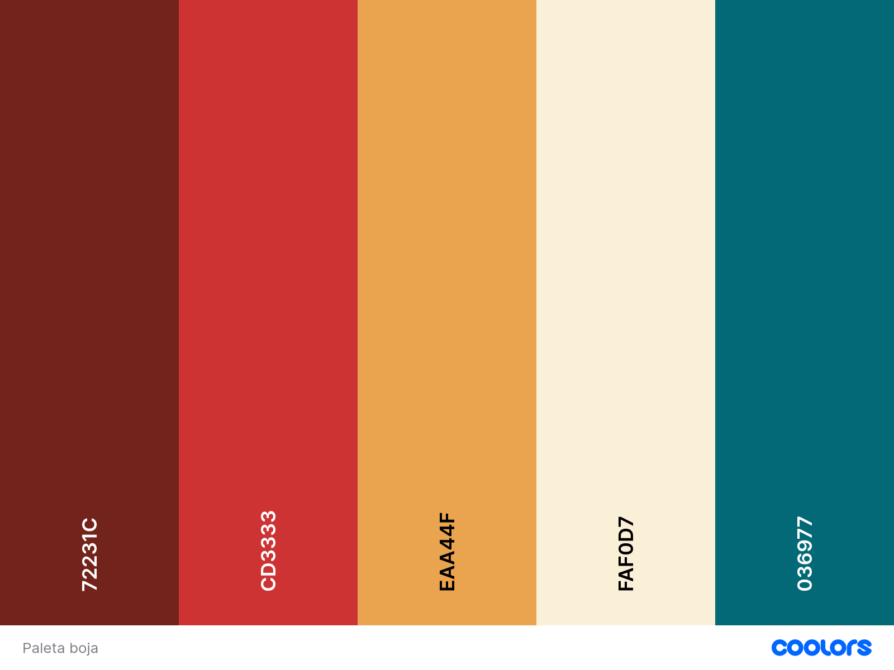

# 🎸 Backstage Caffe – Web Aplikacija

**Backstage Caffe** je dinamična web aplikacija izrađena pomoću React.js, namijenjena ljubiteljima muzike i posjetiocima istoimenog kafića. Aplikacija omogućava pregled svirki, cjenovnika, kontakt sa organizatorima, prijavu/registraciju korisnika te upravljanje sadržajem putem različitih korisničkih uloga.

---

## ✨ Opis projekta

Projekat demonstrira cjelokupan proces izrade i objave moderne web aplikacije – od dizajna do funkcionalnosti. Kroz intuitivan korisnički interfejs i prilagodljiv dizajn, aplikacija omogućava:

- Pregled nadolazećih svirki i ponude
- Kontaktiranje organizatora putem forme sa validacijom
- Pristup korisničkom profilu (Guest/User/Admin)
- Sigurnu registraciju i prijavu
- Prikaz lokacije kafića putem Google Maps-a
- Responzivan prikaz za sve uređaje (desktop, tablet, mobilni)

Poseban naglasak stavljen je na jednostavno korisničko iskustvo i povezivanje digitalnog i stvarnog ambijenta kafića.

---

## 🧰 Tehnologije i alati

| Tehnologija / Alat         | Opis |
|---------------------------|------|
| **HTML5**                 | Strukturna osnova web stranice |
| **CSS3**                  | Stilizacija korisničkog interfejsa i responsivni dizajn |
| **JavaScript**            | Dodavanje funkcionalnosti i interakcije |
| **React.js**              | Izrada komponentno zasnovanog korisničkog interfejsa |
| **React Router DOM**      | Navigacija i upravljanje rutama u aplikaciji |
| **JSON**                  | Format za razmjenu podataka s backendom (simulira bazu podataka) |
| **Google Maps (iframe)** | Prikaz lokacije na kontakt stranici |
| **GitHub**                | Verzionisanje i pohrana koda |
| **Git Bash**              | Rad sa Git-om putem komandne linije |
| **GitHub Desktop**        | Grafički alat za upravljanje Git repozitorijima |

---

## 🗂️ Struktura projekta

Projekt se sastoji od sljedećih ključnih dijelova:

- Komponente (`/components`)
- Stranice (`/pages`)
- Stilovi (`App.css`, `loginstil.css`)
- Lokalna baza podataka (`baza.json`)
- Routing (`React Router DOM`)
- Google Maps integracija

---

## ⚙️ Funkcionalnosti

### 🔐 Autentikacija:
- Prijava korisnika
- Registracija novih korisnika
- Odjava

### 💬 Kontakt forma:
- Validacija unosa
- Ugrađena Google mapa sa lokacijom

### 💾 Baza podataka:
- Simulirana pomoću `JSON Server-a` (`baza.json`)

### 🎨 Paleta boja:
> Kombinacija toplih nijansi bež, narandžaste i bordo tonova (`#FAF0D7`, `#EAA44F`, `#72231C`, `#036977`).
> 

### 🔤 Fontovi:
- **Pathway Extreme**
- **Jockey One**

---

## 👥 Uloge korisnika

| Uloga  | Pristup funkcijama |
|--------|--------------------|
| **Guest** | Početna, Svirke, Prijava, Registracija |
| **User**  | Sve stranice + Kontakt forma |
| **Admin** | Sve stranice + dodatne admin funkcije |

---

## 👩‍💻 Doprinos članova tima

| Komponenta / Stranica     | Autor           |
|---------------------------|------------------|
| Header / Footer           | Ajna Oparić      |
| Contact                   | Ajna Oparić      |
| Home / About / Pricing / Gigs / Shows / ScrollToTop | Berina Helvida |
| LoginForma / RegisterForma / `loginstil.css` | Kenan Dedić |
| App styling (`App.css`)   | Berina Helvida   |

---

## 🚀 Upute za pokretanje projekta

### 1. Otvorite projekat u Visual Studio Code

### 2. Pokrenite sljedeće naredbe u terminalu:

```bash
npm install
npm install json-server --save-dev
npx json-server --watch ./src/baza.json --port 5000
npx json-server --watch ./src/baza.json --port 3001
npm start
